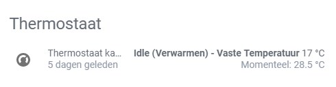


### Thanks for using this custom component.



### This is a Beta version!


[](#) [](#) [](#) [](https://github.com/custom-components/hacs)

### This component only works on HA 0.96 and later. If you are on an older version of HA use [release 0.2.3](https://github.com/custom-components/climate.e_thermostaat/releases/tag/0.2.3) of this component.
### When using HACS installing version 0.3.0 is only allowed for HA version 0.96 and newer.

# Custom component for Dutch E-thermostaat (ICY)
A platform which allows you to interact with the Dutch E-Thermostaat (ICY).

## HA forum
See [this](https://community.home-assistant.io/t/e-thermostaat-icy/493?u=gerard33) post on the HA forum for more info.

## Screenshot
_ICY E-Thermostaat_



## Configuration
**Example configuration.yaml:**

```yaml
climate:
  - platform: e_thermostaat
    username: !secret icy_user
    password: !secret icy_pass
    comfort_temperature: 20
    saving_temperature: 17
    away_temperature: 12
```

**Configuration variables:**  
  
key | description  
:--- | :---  
**platform (Required)** | The platform name.
**username (Required)** | The username of your E-Thermostaat account.
**password (Required)** | The password of your E-Thermostaat account.
**comfort_temperature (Optional)** | The comfort temperature (Comfortstand), defaults to 20.  
**saving_temperature (Optional)** | The saving temperature (Bespaarstand), defaults to 17.  
**away_temperature (Optional)** | The away temperature (Lang-weg-stand), defaults to 12.  


This platform is using the [E-Thermostaat API](https://www.e-thermostaat.nl/) to get the information from the thermostat.
This component is only usefull for Dutch users as the E-Thermostaat is only sold in The Netherlands.
